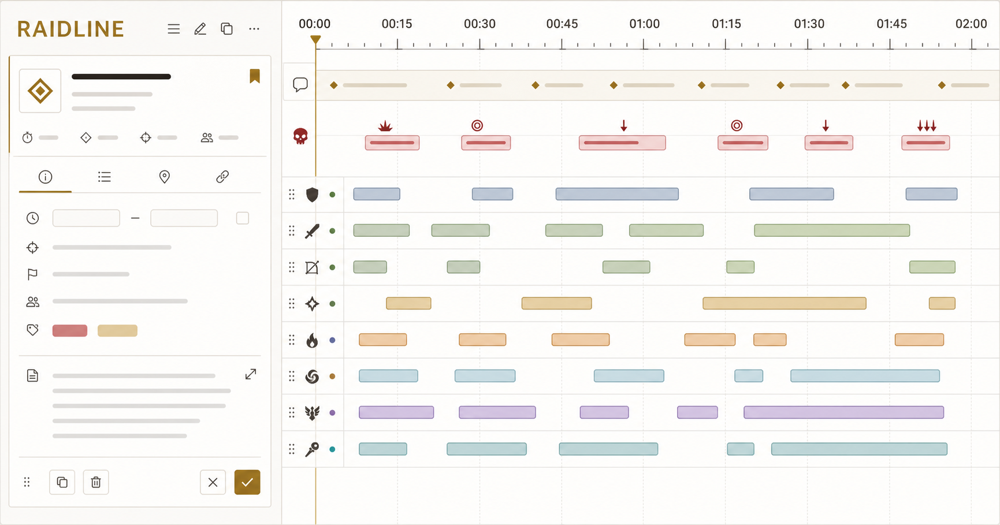

# 团轴 Raidline

面向《魔兽世界》团本的本地优先排轴工具。工作副本保存在浏览器 IndexedDB；只有玩家明确发布时，才会把点击瞬间冻结的计划快照写入服务端数据目录。



## vNext v1 模型

Raidline 当前采用全新的严格 v1 格式，不读取或迁移旧 plan v5、catalog v3、旧 IndexedDB 测试数据或旧分享正文。

- `RaidPlanDocument.schemaVersion` 固定为 `1`，包含独立计划标题、遭遇、来源、定义快照、名单和时间轴。
- 技能与机制定义保存在 `definitions`；计划内实例只引用稳定 UUID。目录或 WCL 来源失效后，完整快照仍可使用。
- `roster` 保存稳定成员槽位、多策略组、可选 1–8 小队和成员级技能变体；计划正文不保存服务器或 WCL actor ID。
- `timeline` 分开保存阶段、机制实例、战术任务/说明和技能安排。
- 所有计划全局时间只持久化为 `TimelineAnchor`：开怪后、阶段开始后，或机制施法开始/命中/结束后的偏移。WCL 导入的单次机制可以保存整秒的施法/持续时长覆盖，以保留该轮实际判定点；拖动仍只修改当前锚点偏移。
- BOSS 机制定义用严格的 `timelinePresentation.parts` 保存一个 occurrence 内的多个阶段区间与判定点。紧凑模式将阶段气泡左对齐到准确时间，碰撞时增加说明层并按需省略，条形独立显示；宽松模式按稳定机制定义固定子轨道，时间区域只显示条形。布局和 `4×–16×` 缩放只保存在本机视图偏好中。
- 计划对象按 1 秒对齐；显示范围由可解析内容结束点加 30 秒后自动计算，范围为 2–120 分钟。
- 结构解析拒绝旧版本、未知字段、重复实体 ID、非整秒计划时间和超过 1 MB 的计划；引用循环、悬空引用和职业不匹配由独立语义诊断处理。

## 本地保存与发布

- `plans` 保存工作副本，停止编辑 300ms 后写入；`localRevision` 阻止旧标签页静默覆盖新标签页。
- `snapshots` 每分钟以及发布、目录升级和破坏性操作前建立检查点；每条轴保留 30 个，总量限制为 100 MB。
- `catalogCache` 缓存当前目录，`settings` 只保留主题等设备级界面设置。IndexedDB 升级到 vNext 时会清空旧计划、旧检查点和旧目录缓存。
- 工作副本没有自动云端保存、账号同步或 JSON 文件导入导出。
- 只读地址为 `/s/{shareId}`，编辑入口为 `/s/{shareId}/{editId}`；ID 分别严格使用 16 位和 4 位 `[0-9A-Za-z]`。
- 编辑入口只是把服务器快照复制到当前浏览器。覆盖和删除必须显式操作；编辑 ID 不作为高强度安全凭证。

## 内容目录

仓库内置严格 catalog v1 种子目录：[data/catalog-seed.json](data/catalog-seed.json)，运行时还会组合已经校验的 Vashnik fixture。当前内置 release 共包含 5 个牧师排轴技能、11 个机制和 2 个不含名单或执行安排的 Boss 骨架，其中 Vashnik 示例来自 fight 32 的完整事件转换结果。

应用预设时会把所需机制定义与当前技能定义复制进计划。已发布目录继续按以下相对路径保存在服务端数据目录，并在所有文件写入后更新 current 指针：

```text
catalog/releases/{version}/manifest.json
catalog/releases/{version}/player-skills.json
catalog/releases/{version}/boss-mechanics.json
catalog/releases/{version}/timeline-presets.json
catalog/current.json
```

`/admin` 提供 v1 技能、机制和 Boss 骨架表单，以及校验与显式发布。运行时需要独立管理员配置：

```dotenv
ADMIN_PASSWORD_HASH=<管理员口令的 SHA-256>
ADMIN_SESSION_SECRET=<随机会话签名密钥>
```

## WCL 与导出边界

- `CombatLogSnapshot`、`EncounterConversionProfile`、`PlanImportDraft` 和 `ComparisonRun` 都有提供者无关的严格 v1 契约与 fixture。
- 首页可以粘贴 `cn.warcraftlogs.com` 等允许域名的公开报告链接。服务端使用 client credentials 读取报告、Boss 战斗和 WCL 官方 `phaseTransitions`；史诗战斗还可在精确匹配 encounter profile 后分页读取转换所需事件。浏览器不会接触 client secret 或 access token。
- 网站 WCL 边界只读且不做服务器持久化：导入预览会匿名化事件、丢弃玩家姓名与无关字段，只返回机制候选和严格 plan。用户显式确认后，所选机制才保存为浏览器本地计划；不会写 WCL 快照、数据库、队列或分享。
- 探针可列出非史诗战斗并标记为不支持；一旦进入快照或导入边界，非史诗战斗以 `UNSUPPORTED_DIFFICULTY` 停止，难度不写入长期结构。
- 战斗快照保留原始毫秒精度；GraphQL DTO、WCL 缩写和插件语法不会进入计划模型。
- 开发者可以用 `wcl:download` 在被 Git 忽略的 `work/` 中完整缓存指定战斗事件，用 `wcl:review` 生成逐事件族人工审查材料，再用 `wcl:convert` 模拟“fight 元数据 → 精确 profile → 清洗快照 → 导入草稿 → 计划”的本地纵向链路。该流程不属于网站 API；当前兼容测试源也不是生产依赖。
- 当前真实网站回归使用正式服公开报告 `LgdFn8NyAGRqWT3V` 的 fight 64（encounter `3455`）：分页读取 150,497 条事件，匿名清洗保留 5,730 条，按中文 profile v2 生成 50 个机制候选，转换警告与未解析事件均为 0。历史 encounter `3134` fixture 只保留为既有目录示例和 profile revision 依据，不是当前真实请求依赖。
- 导出统一使用 `ExportRequest → ExportResult`。首个导出器为 MRT 阅读版；无法可靠表达的阶段触发会产生显式降级警告，阻断错误不会静默输出。

提供者无关的契约 fixture 位于 [data/fixtures](data/fixtures)，WCL GraphQL 边界 fixture 位于 [tests/fixtures](tests/fixtures)。

## 本地运行与验证

需要 Node.js 22.13 或更高版本，以及 pnpm。

如需测试真实公开 WCL 报告，先把 `.env.example` 复制为被 Git 忽略的 `.env.local`，填写从 Warcraft Logs 创建的 API client：

```dotenv
WCL_CLIENT_ID=<本地 client id>
WCL_CLIENT_SECRET=<本地 client secret>
WCL_TOKEN_URL=https://www.warcraftlogs.com/oauth/token
WCL_API_URL=https://www.warcraftlogs.com/api/v2/client
```

不要给这些变量增加 `VITE_` 或 `NEXT_PUBLIC_` 前缀。API 地址保持可配置，以便之后在中国大陆生产服务器上实测并选择可用入口。

```bash
pnpm install
pnpm dev
pnpm test:unit
pnpm lint
pnpm build
pnpm test
```

无自有 WCL API client 时，可以使用当前可替换兼容源完成本地 PTR 研究；缓存与审查材料不会进入 Git：

```bash
pnpm wcl:download -- --report baxm3wf8MDvF6V7W --fights 26,28,29,31,32
pnpm wcl:review -- --report baxm3wf8MDvF6V7W --fights 26,28,29,31,32
pnpm wcl:convert -- --input-root work/wcl
```

测试覆盖严格读取、锚点解析与循环、自动范围、多策略组与小队、阶段任务与说明、技能充能/施法/引导、目录快照隔离、WCL 链接/OAuth/阶段边界、16+4 发布规则和发布 API。

## 项目结构与开发入口

Raidline 将“计划数据”“时间轴解析”和“页面展示”分开，便于在不改动编辑器交互的情况下替换存储或增加导入器：

```text
lib/domain/schema.ts       严格 v1 Zod schema 与推导类型
lib/domain/timeline.ts     锚点解析、目标解析、语义诊断
lib/domain/view-model.ts   RaidPlanDocument → TimelineScene
lib/core.ts                计划业务规则、冲突检查、统一导出
lib/catalog.ts             目录校验、预设应用、快照升级
lib/publications.ts        发布对象和 16+4 分享规则
lib/wcl-report.ts          WCL 链接、报告 DTO 校验与阶段规范化
lib/wcl-client.ts          服务端 OAuth、token 缓存与 GraphQL client
lib/wcl-server.ts          Node 服务端环境变量配置边界
lib/wcl-contract.ts        规范化快照和转换 profile 的接收边界
lib/wcl-conversion.ts      profile 精确选择、聚类/派生、导入草稿与计划落地
scripts/wcl-convert.ts     Git 忽略完整事件的本地纵向模拟
app/components/            首页、双栏编辑器、只读页和目录管理
app/api/                   发布、目录和管理员边界
data/catalog-seed.json     内置 v1 目录
data/fixtures/             WCL/导入/对比契约 fixture
tests/                     单元和渲染/API 集成测试
```

详细的依赖边界、数据流和后续里程碑见 [架构说明](docs/architecture.md)；贡献者先阅读 [贡献指南](CONTRIBUTING.md)，AI 或自动化开发先阅读根目录 [AGENTS.md](AGENTS.md)。需求决策以 [需求索引](docs/requirements/INDEX.md) 和当前 vNext 文档为准。

### 修改前的最小流程

1. 运行 `git status -sb`，确认没有覆盖其他人的未提交改动。
2. 阅读相关 schema、业务函数和测试；不要从旧 v5/v3 代码推断兼容行为。
3. 先补充失败测试，再实现改动；领域模型变化必须同时更新 fixture 或往返测试。
4. 运行 `pnpm test:unit`、`pnpm lint`、`pnpm build`，涉及页面或 API 时再运行 `pnpm test`。
5. 在 PR 中说明数据模型影响、迁移/不兼容决策、测试结果和未完成边界。

主分支只接受可审阅的功能提交；日常开发请从 `main` 创建 `codex/<topic>` 或 `<topic>` 分支。不要提交 `.env`、WCL 凭据、管理员口令、生产数据、构建产物或临时分享内容。

## 运行边界

当前仓库不维护任何托管平台部署配置，只支持本地开发、测试和之后明确规划的自有服务端运行。真实 WCL 探针与本地研究工具仅在开发者本机或之后的自有服务端使用。

服务端发布数据默认写入被 Git 忽略的 `.raidline-data/`，可用 `RAIDLINE_DATA_DIR` 指定其他本地目录。长期生产目标是中国大陆普通 Linux 服务器；SQLite、内容寻址持久目录、异步 WCL 事件采集与快照库将在后续阶段按独立契约实现。

Raidline 是社区工具，与 Blizzard Entertainment 没有官方关联。
